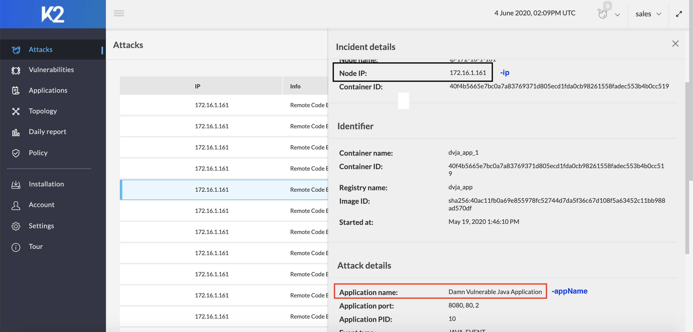

# K2-Report-Generator-API

This repository contains code to merge vulnerability scan report produced by DAST solution (e.g. Tenable) with the results K2 generates during those scans.

The executable JAR package will produce combined report.

This is an executable JAR package.

Build Jar using command:

```
mvn clean package
```

Use Case:

```
java -jar k2-report-generator-api.jar -dast "<vendor-name>" -outputDir "<output-dir-path-where-reports-will-extract>" -dastProperties "<path-to-dast-properties-file>" -k2Properties "<path-to-k2-properties-file>" -scanId "<scan-id>" -ip "<ip>" -appName "<web-application-name>"
```

**Note** : All parameters are mandatory

### Parameter information
-dast : vendor name (ex. tenable)

-outputDir : Final reports will be created in this repository, repository will be created if not present

-dastProperties : Update [dast.properties](dast.properties) file and provide full path of dast.properties file using this Parameter.

-k2Properties : Update [k2.properties](k2.properties) file and provide full path of k2.properties file using this Parameter.

-scanId : Numerical scan id number of the scan for which reports has to be processed.

-ip : Private IP of the machine on which scan has been run.

-appName : Web application name on which scan has ran.


### How to get ip?
Once the scan completes get the hostIp from any one of the incident for that scan from K2 Manager UI.(See screenshot)

### How to get appName?
Once the scan completes get the appName from any one of the incident for that scan from K2 Manager UI.(See screenshot)



### Sample dast.properties
```
tenableUrl=https://cloud.tenable.com
accessKey=
secretKey=
```
### How to get the DAST propperties for Tenable?
Login to tenable.io, Go to My Account -> API Keys and generate API keys.

### Sample k2.preoperties
```
k2Url=https://www.k2io.net/centralmanager
k2CustomerId=
k2CustomerEmail=
k2CustomerPassword=
```
### How to get the K2 properties?
Use k2io.com account, customerId and credentials in k2.properties.

### Sample output
```
STEP 1: Initialization

Printing user parameters:
dast : tenable
dastProperties : /Users/prateek/Downloads/RGA/dast.properties
k2Properties : /Users/prateek/Downloads/RGA/k2.properties
scanId : 22
ip : 172.16.1.161
appName : Damn Vulnerable Java Application
outputDir : /Users/prateek/Downloads/RGA
Creating directory /Users/prateek/Downloads/RGA
==========================
STEP 2: Connecting to Tenable

url : -> https://cloud.tenable.com/scans/22
Tenable Scan info for ID: 22
{"alt_targets_used":false,"shared":null,"tag_targets":null,"user_permissions":128,"acls":[{"owner":null,"permissions":0,"name":null,"id":null,"display_name":null,"type":"default","uuid":null},{"owner":1,"permissions":128,"name":"kiran@k2io.com","id":2,"display_name":"kiran@k2io.com","type":"user","uuid":"b7e7ebf1-adc6-4b49-a84d-4a6c24b11480"}],"scan_type":"webapp","uuid":"eb437554-4139-430c-b11e-a8aa150d2104","targets":"http:\/\/52.55.46.1:8080\/","scanner_start":null,"hostcount":0,"haskb":false,"scanner_end":null,"policy":"Web App Scan","timestamp":1589923748,"owner":"kiran@k2io.com","schedule_uuid":"45154b97-9ff8-6f14-3615-1beadd6d4be355e3c841265ba998","pci-can-upload":false,"scan_end":1589923748,"control":true,"hasaudittrail":true,"scanner_name":"US Cloud Scanner","object_id":22,"is_archived":false,"no_target":false,"name":"prateek-dvja","edit_allowed":false,"scan_start":1589894720,"folder_id":3,"status":"completed"}
Tenable Scan Start Timestamp : 1589894720
Tenable Scan End Timestamp : 1589923748
Tenable Report Export Response : {"file":"c52d4a02-3a6f-4521-ae3a-4b4217276360"}
File name : c52d4a02-3a6f-4521-ae3a-4b4217276360
Tenable Export Status Response : {"status":"ready"}
Status : ready
Saving Tenable Report in file : /Users/prateek/Downloads/RGA/Tenable-Report.csv
==========================
STEP 3: Connecting to K2

K2 Login Response : ok
Logged in successfully, Session created.
Saving K2 Report in file : /Users/prateek/Downloads/RGA/K2-Report.csv
Filtering K2 report for hostIp and appName
==========================
STEP 4: Parsing K2 report

Parsing K2 csv report
K2 CSV parsing completed
==========================
STEP 5: Parsing Tenable report

Parsing Tenable csv report
Tenable csv parsing completed
==========================
STEP 6: Merging the reports

PRINTING VULNERABILITIES
/listProduct.action : Reflected XSS Attack
/listProduct.action : SQL Injection Attack
/userSearch.action : SQL Injection Attack
/ping.action : Remote Code Execution
Writing K2 & Tenable joint PDF report/Users/prateek/Downloads/RGA/K2-Tenable-Report.pdf
Writing K2 & Tenable joint CSV report/Users/prateek/Downloads/RGA/K2-Tenable-Report.csv
```
